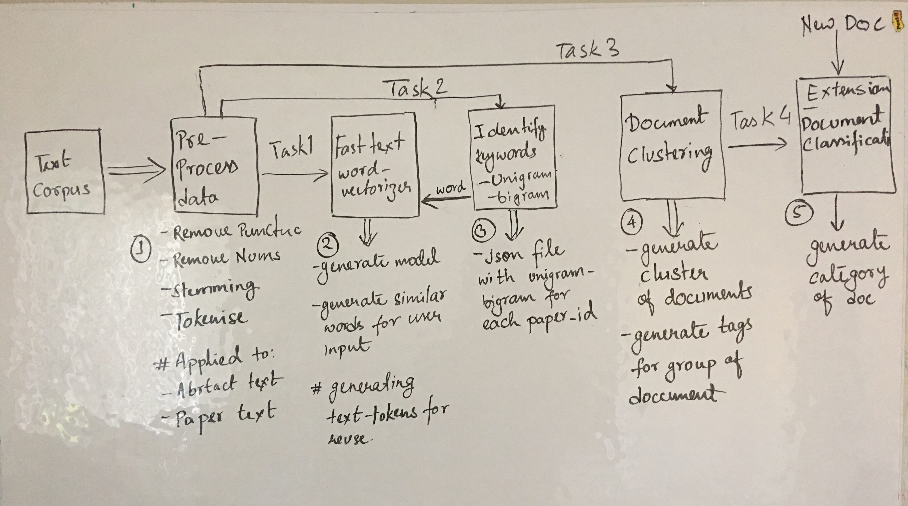

# Challenge: NIPS Data Analysis

## Get the data
We will be using the Neural Information Processing Systems (NIPS) 2015 conference papers as a text corpus. These can be obtained off Kaggle, which requires that you create a free account, at [this link](https://www.kaggle.com/benhamner/nips-2015-papers/version/2). An [overview](https://www.kaggle.com/benhamner/nips-2015-papers/version/2/home) talks about the data, which is available as a csv, in raw form from the PDFs, and also already stored into a sqlite db.

## Programming Language
All work should be completed in Python. **Please use Python 3.6+!!**

## Basic Info
Although we are only going to be working with the NIPS dataset, consider that this might be used later on to process a dataset much larger (eg an entire sub-reddit or all the articles from a news publication). Your ideas should be reusable and scaleable. Final work should be in commandline executable form and should allow the user to start with the files mentioned above and do all the following tasks.

## Tasks
### 1. Generate FastText word embeddings
One of the standard building blocks in NLP is the word embedding. The gold standard used to be word2vec embeddings, however we will be creating FastText embeddings instead due to their ability to deal with out-of-vocabulary words. Ensure that - 
1. `you can support a user-defined number of dimensions` 
2. `have the ability to turn on/off at least one text-preprocessing step`.

### 2. Generate a list of keywords
Within every text corpus, there are certain keywords that are specific to that corpus. Although keywords may normally be monograms, be sure that your methods can identify at least bigrams as well.

### 3. Group the documents
In addition to keywords, a corpus will generally have clusters of topics. Group the documents together (ie output groups of document titles) and identify how they are grouped.

## Additional Info
Logical organization and comments help to make code more understandable and maintainable. Keep this in mind as you write your code! Feel free to use any packages that you would like. Please check all your code into a publicly accessible Github repo and send me an email with link to your work.

## Details of Implementation

Above diagram represent the data analysis pipeline. It consist of four major steps and an additional step. In the pipeline it can be seen that all the three key tasks can be accomplished independently without dependency on other task and can be independently scaled up or down. All the configurations can be controlled by user for the three tasks. Also, the results generated by one task can be reused in other tasks. There is no tight coupling in any part. Based on this design following tasks can be accomplished with the existing data and the pipeline:

**Core Tasks**
- Deep Linguistics - Identifying related words to an input word and finding closeness of the words in step 2
- Aspect Identification - Identifying keywords in the documents in step  in step 3
- Text Mining - Text clustering using LDA in step 4

**Additional Task**
- Document Categorization - This can be done in step 5 using FastText, clusters from step 4 can be assigned a category to which will serve as training data for text classification.   
- Entity Extraction - Tokens stored in step 2 can be analyzed to indentify entities mentioned in (i.e. Extracting entities such as person, time, place etc.)

Following sections describe this pipeline in more details - 

### Input
Input is in form of a csv file. The file has following colums - 

`['Id', 'Title', 'EventType', 'PdfName', 'Abstract',
       'PaperText']`
       
Of these only four columns are valuable to current scope of work -
 
`['Id', 'Title', 'Abstract', 'PaperText']`

So I have removed rest of the columns.

### Step 1:
The first step after reading data is to clean the input. This pre-processing step is needed by all the later stages down the line. There are different actions that can be taken - removing punctuations, removing numbers, converting string to lower, removing html tags. User can decide what steps in this pipeline can be skipped by providing run-time arguements. In this implementation a user can enable or disable check for is_html (if data is html then clean html tags) and stemming.

### Step 2: 
After text data is clean, I created a word-vector to generate word-representations for any input word. Word vectorizer generates a fast-text model which is saved and can be reused. I have generated a list of tokens that can be used in down pipeline for `entity-extraction`. To validate the results generated I have genreated graph containing nearest word. This can be done for any set of words. A user can determine the dimension of word-vector with run-time arguement or the model can be used to generate real-time prediction to incoming stream of words. 

### Step 3:
To extract keywords from each text document, fist step is to find candidate keywords. Keywords are words that are noun(unigrams) or contain noun word (bigram). Identification of noun words take a linear scan of all tokens. Once the unigrams have been identified candidate unigrams are ones that occur more than the threshold (this threshold can be configured by user). For each document the unigrams and bigrams are being written in a json file.

There is an arrow from step 3 going back to step 2. This is to show that once the keywords have been identified for a document, the words can be passed to word-vector to see what other words are being used in the corpus for the keywords. This will help to correlate the keywords to similar words in entire corpus

### Step 4:
This step perform clustering of documents based on the common features of documents. Document clustering can be performed in multiple ways - Clutering (k-means, hierarchical) or  LDA. I have chosen LDA for the simplicity but the class can be extended to include k-mean clustering algorithm. The number of clusters are user defined. By default I am looking for 5 clusters and matching the documents based on the content of the paper. Similar documents occur in a cluster as they have similar topic on which they are presenting. The output of the step is the cluster of documents where key is the cluster id and corresponding to that there is a list of similar papers. Lower cluster number tend to cluster more uncommon paper in similar bucket so larger number of clusters (>10) are advised on a larger dataset.

### Step 5: 
This step is extension of step 4. Once the clusters are generated, tags can be assigned to clusters. Once all the documents have been tagged then this dataset can be used to build a fasttext document classifier like one mentioned here -  https://fasttext.cc/docs/en/supervised-tutorial.html . Once the classifier is created new documents can be classified in real-time basis.

## Testing
I haven't created standard test cases for my tasks but had a work-around solution for this. Testing was perfromed on `Abstract` of the papers as the data for Asbtract was small compared to actual Text and easy to train.    
1. **Task1:** For validating this task I have generated visualization to assess closeness of the words generated by word-vectorizer. Also generating top-10 words close to input words
2. **Task2:** For this task which required me to count the top aspects, I am matching the count of unigram aspect words to the dictionary kayes I have created for all the words in the the document abstract.
3. **Task3:** Testing for this part has been tricky as I was not able to generate a good visualization to represent closeness of the data. I have taken a subset of papers and then for papers clustered together identified overlapping words. (Also I manually verified the cluster as I haven't identified a testing strategy)   

## Design consideration
1. System do not have tight coupling between any components of the pipeline except for the dependency on pre-processing step.
2. All the parameters can be configured by user
3. System can handle html and regular text data
4. Models for Fast_text and LDA are saved and can be reused later
5. Tokens stored in step 2 can be used to identify entities involved in the documents/text corpus. 

## Extensibility
1. The project can be extended to html documents as text pre-processing is being performed to remove HTML based tags.
2. The project can be extended for reviews and comments about an entity, in NIPS use case the tasks are being performed for a Paper_id where as in case of reviews the reviews can be aggregated for an entity e.g. restaurant or product. 
3. Currently data is being read from existing csv file, but this use case can be extended for a simple real-time stream where either the data will be appended to a csv file or can be appended to a queue for certain time-window.    
4. In addition to core-features required for the project the project can be extended to perform sentiment analysis for reviews/comments data based on some training data. 
5. In addition to this text searching can be performed by indexing data against Solr/Elastic Search. 
6. Currently data visualization is done for testing but full-fledged dashboards can be generated using Banana dashboard.   

## Challenges
There are some challenges and limitations to the current method. 
1. Bigrams generated are not significantly important in the document. To identify significant bigrams I can check for the noun item and then check for the frequency in document and if significant consider JJ+NN pair as good bigram

2. Currently I am using pandas dataframe, these would start to slow down in performance after data grows bigger than ~1gb. To scale this up I would need to use spark dataframe 

3. Fun challenge - 1.Anaconda blocked by IT recently, 2. I spilled coffee at my laptop, keyboard all messed up

## Run Instructions
To run the application run the script run.sh, edit the script to update the parameters if needed.
